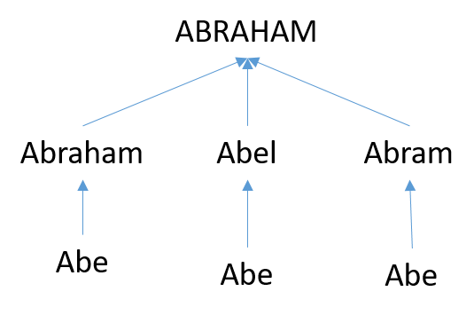

# First Name Standardization

These files are used to standardize first names (sometimes called "given names" as opposed to family names) in order to perform disambiguation procedures on board members and officers. 

The challenge is that people often go by a shortened or informal version of their name. Robert might go by Rob, Bob, or Bobby. Alexandra might go by Alex. Etc. 

These variants are referred to as:

* nicknames 
* diminutive
* short forms 
* pet names 
* Hypocorisms ("child talk") 
* terms of endearment 

One way to approach name standardization is converting all diminutive versions of names back to their proper form. The basic substitution would be something like:

nickname | propername 
---------| ------------ 
rick | richard 
rich | richard 
ricky | richard 
dick | richard  

There are many challenging edge cases. Some nicknames are a variant of several proper names, which would result in the need for relative frequency of usage. For example, is Kate a diminutive version of Katherine, Catherine, or Kathlene? And some nicknames abstract away from the gender. For example, should Alex be Alexander or Alexandra?

There are also conflicts in spelling of the proper names. For example, should Jeff be Jeffrey or Geoffrey? 

For purposes of disambiguation we would not want to standardize the spelling of names, Shawn versus Sean, etc. But we would want to map all diminuitives onto their formal versions. 

One approach would be to map all nicknames onto proper names, and all proper names onto the most common version.

One Abraham to rule them all:  

Some current resources and dictionaries:

https://github.com/carltonnorthern/nickname-and-diminutive-names-lookup

## Open Data threads on Stack Exchange

https://opendata.stackexchange.com/questions/9777/nicknames-database/9779

# GitHub: jonathanhar/diminutives

https://github.com/jonathanhar/diminutives.db

# GitHub: onyxrev/common_nicknames

Over 1,000 mappings:

https://github.com/onyxrev/common_nickname_csv

# Lookup Function for Nicknames

https://github.com/carltonnorthern/nickname-and-diminutive-names-lookup

Over 1,000 Name --> Nicknames

https://github.com/carltonnorthern/nickname-and-diminutive-names-lookup/blob/master/names.csv

# SOEMPI name_to_nick.csv

Secure Enterprise Master Patient Index is a Scientific record linkage tool for performing privacy preserving and non privacy preserving record linkage. It is based on OpenEMPI and the research and the work is conducted by the Vanderbilt University.

450 mappings:

https://github.com/MrCsabaToth/SOEMPI/blob/master/openempi/conf/name_to_nick.csv

# Relative Prob of Replacement

This file includes 550 cases where nicknames might map to several formal names with the relative probability of each mapping:

https://web.archive.org/web/20181022154748/https://deron.meranda.us/data/nicknames.txt

| Nickname | Name      | Prob  | 
|----------|-----------|-------| 
| AL       | ALAN      | 0.40  | 
| AL       | ALBERT    | 0.60  | 
| AL       | ALDO      | 0.20  | 
| AL       | ALEXANDER | 0.20  | 
| AL       | ALFONSE   | 0.40  | 
| AL       | ALFRED    | 0.50  | 
| AL       | ALLAN     | 0.30  | 
| AL       | ALLEN     | 0.30  | 
| AL       | ALONZO    | 0.45  | 

It's unclear what the last column represents because they don't add to 1 ("note, column 3 is mostly guesswork"). But they could be used for selecting the most common substitution. 

# NameDB

Database of over 10,000 given names and 30,000 variants. 

https://incompetech.com/named/

But it is proprietary. It costs $20. A preview is available here:

https://incompetech.com/named/NameDB%20Samples.zip

# Comprehensive Database of Name Variants

https://github.com/tfmorris/Names

Over 70,000 name variants:

https://raw.githubusercontent.com/tfmorris/Names/master/search/src/main/resources/givenname_similar_names.csv

And some nicknames:

https://github.com/tfmorris/Names/blob/master/eval/src/main/resources/givenname_nicknames.txt

# Baby Names Dictionary 

Includes variants (nicknames) and popularity:

https://www.weddingvendors.com/baby-names/meaning/tom/

# GINAP Project

## GINAP - GIven Name mAPper

From: [https://www.galbithink.org/names/ginap.htm](https://www.galbithink.org/names/ginap.htm)

This name standardization code **(GINAP, a GIven Name mAPper)** concerns English-language personal given names, as well as some Latin forms of common English given names. GINAP groups together names that either sound the same, have the same public meaning, or changed only in the recording process (spelling errors, recording errors, etc.). It corrects the sex indicator errors for common, sex-unambiguous names. It also maps common generic names (Mr, Mrs, infant, baby, etc.) and single letter names to the null code represented by a period (".").

GINAP is offered on an open source basis under the GNU General Public License. Scholars are encouraged to modify and expand the code. But please indicate clearly in citing and distributing a new code the source version you used and any changes that you made. This information is important for duplicating and comparing results, and for progressively improving the quality of the code.

For other information and sources relating to the analysis of the distribution of given names, see the Given Names Frequency Project.

Procedure for running GINAP:

Create new fields gname and sex in a relational database in which named persons constitute the records. Original name and sex fields should not be deleted or overwritten, but should be retained to prevent loss of information. The new fields gname and sex are defined as follows:

gname: a text field derived from a person’s given name written in the standard 26 letter modern English alphabet. If the given name has more than eight letters, gname consists only of the first eight letters. If the given name includes a space, period, hyphen or other non-alphabetical characters, gname includes only the letters preceding the first such character. The first letter of gname is a capital letter; any subsequent letters are small letters.

sex: an integer indicating the person’s sex (1=female, 2=male). If no sex indicator is available, code all records with 2. This code has been chosen because medieval records primarily consist of male names, and hence sex correction codes for medieval names in GINAP focus on male-to-female corrections.

Open in a text editor the current version of GINAP (1.1) (version 1.0 is here) and delete the GNU General Public License header (and the data field headers if your database cannot read them). Save the result as temporary file ginap-m.txt.

Import the comma-delimited text file ginap-m.txt into your database into a table named ginap. Note that the layout of fields in ginap is sex-o, sex-s, gname-o, gname-s. The name standardization maps the fields sex-o and gname-o ("originals") into sex-s and gname-s ("standardized forms").

Join the fields sex-o and gname-o in the table ginap to the sex and gname fields in your records. Run a query that updates the sex and gname fields in the matching records to sex-s and gname-s, respectively.

Note: In counting records for calculating name popularities, null records (coded to a period (".")) should be excluded.

---

## GINAP-version-1.0.csv

Copied from the original version here: [https://www.galbithink.org/names/ginap.txt](https://www.galbithink.org/names/ginap.txt)

GINAP, Version 1.0 - name standardization code for English-language 
personal given names, as well as some Latin forms of common English 
given names

This code is a free software program; you can redistribute it and/or modify 
it under the terms of the GNU General Public License as published 
by the Free Software Foundation; either version 2 of the License, 
or (at your option) any later version.  For a copy of the GNU
Public License, 
see http://www.opensource.org/licenses/gpl-license.html

This code is distributed in the hope that it will be useful, 
but WITHOUT ANY WARRANTY; without even the implied warranty of 
MERCHANTABILITY or FITNESS FOR A PARTICULAR PURPOSE. See the GNU 
General Public License for more details.

The author of Version 1.0 is Douglas Galbi.  He can be contacted by 
e-mail at zeitgeist98@iname.com or by paper mail at 1307 N. Ode St., 
Apt. 435, Arlington, VA 22209.  For details on running this code,
see http://www.galbithink.org/names/ginap.html  

