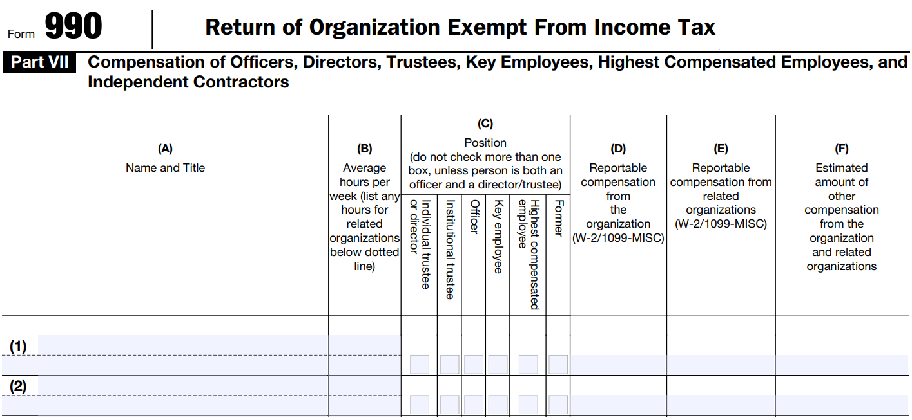
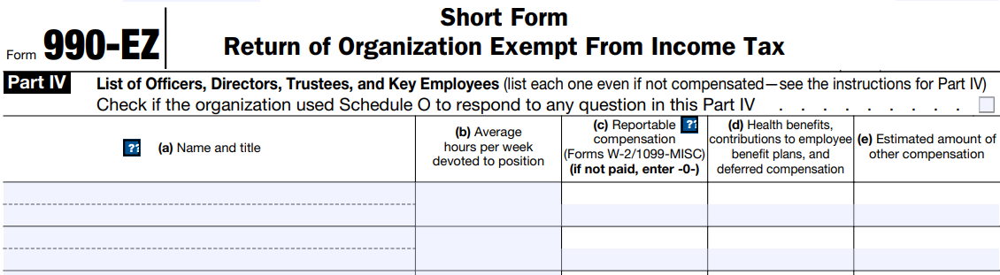

# IRS Form 990 Fields 

**Part VII: Compensation of Officers, Directors, Trustees, Key Employees, Highest Compensated Employees, and Independent Contractors**

Part VII of the IRS form 990 requires nonprofit organizations to disclose information about organizational leadership, the board of directors, highly-compensated employees, and independent contractors. Both form 990 (the regular nonprofit tax form) and form 990-EZ (an abbreviated form that smaller nonprofits can elect to use) require disclosures about the organization's leadership. The fields differ slightly on each. 

Similar to the **name** field on the IRS 990 e-file forms, the **title** field is an unstructured text field where the organization enters the titles of their managers, directors, and key employees. As a result, although we might expect only a few dozen common titles in reality we observe over 750,000 unique titles used because of the way they are entered, spelled, abbreviated, or combined.

**Raw title text examples:**

_cfo_, _executive director - no longer director_, _president local # 18_, _foundation mana_, _director of park planning & development_, _director_, _scout execut_, _controller_, _dir & president_, _senior vp_, _operations manager_, _manager/ceo_, _chief executive officer_, _director_, _business man_, _executive di_, _executive director_, _executive di_, _executive director as of 10/25/2016 3_, _program director_, _executive di_, _business agent_, _executive director_, _field representative - new_ and _golf course superintendent_

On the 990 form only (not the 990-EZ), the IRS uses check-boxes to designate roles of those listed on the form.  See below for more detailed definitions provided on the 990 instructions.

* **Individual trustee or director** - "a member of the organization's governing body, but only if the member has voting rights".   
* **Institutional trustee** - "a trustee that isn't an individual or natural person but an organization, e.g. a bank or trust".   
* **Officer** - "a person elected or appointed to manage the organization's daily operations".   
* **Key employee** - must have (1) compensation over $150,000, (2) "has responsibilities, powers, or influence over the organization as a whole that is similar to those of officers, directors, or trustees", and (3) is among the top 20 managers in the organization.   
* **Highest compensated** - five highest paid non-officer and non-key employees with compensation in excess of $100,000.   
* **Former** - former officers, key employees, and highly compensated employees with currently makes over $100,000 as a consultant or ex-officio, or any former director or trustee that receives over $10,000.   

The instructions require that only one option is selected "unless person is both an officer and a director/trustee." **In practice, there seems to be a lot of confusion about some of these definitions and nonprofits are fairly inconsistent in how they apply these codes.** 

## Names Field

The original dataset contains a raw text field for names with no restrictions on what can be entered. As a result, it is rather chaotic, difficult to distinguish first and last names, and can contain additional text:

 _Kimberly Opsahl_, _CARLETTA HAUCK_, _LORIN SARBACHER_, _CRAIG ATKINSON_, _ALAN ZILBERT_, _JILL BECKWITH_, _MELINDA MARRIOTT_, _MARTHA BURNES_, _JAMES MOCK_, _DR EMOGENE KAISER_, _D EDWARD COLE_,  _EWA_, _ROBERT BEAUDRY - PAST_,  _MARY JO DUNCAN_, _THIEN CHAU NGUYEN_, _LLOYD JAMES SR_ and _ELIZABETH SQUILLACE_

  

# Standardization of Fields 

## Name Normalization 

Raw name text fields are parsed into the following fields:

* First name 
* Middle name 
* Last name 
* Salutations and titles (MS, DR, PHD) 
* Suffixes (JR, II, III) 

Gender has been added by matching the individual's first name to the Social Security Administration's birth certificate database that provides a count of men and women with that exact first name. Gender is assigned by selecting the mode of the two (proportion of people with that name that are male or female).  

* Gender code 
* Confidence (prop. of people with that first name and that gender) 

 

## Standardized Titles

We have attempted to convert the set of raw title codes to a small set of meaningful titles. Routines have been applied to clean up the raw text, fix spelling errors, convert abbreviations to a standardize set, and map . 

## Clean Titles 

In the initial step text processing routines are applied to remove punctuation, normalize capitalization, standardize abbreviations, and fix spelling errors.  

|**Raw Text**                       |**Cleaned Text**                   |
|:----------------------------------|:----------------------------------|
|EXECUTIVE DI                       |EXECUTIVE DIRECTOR                 |
|EXEC DIREC                         |EXECUTIVE DIRECTOR                 |
|PRESIDENT                          |PRESIDENT                          |
|TREASURER                          |TREASURER                          |
|SECRETARY                          |SECRETARY                          |
|Director                           |DIRECTOR                           |
|SECRETARY-TREASURER/BUSINESS AGENT |SECRETARY TREASURER BUSINESS AGENT |
|PRESIDENT/BUSINESS AGENT           |PRESIDENT BUSINESS AGENT           |
|VICE PRESIDENT/BUSINESS AGENT      |VICE PRESIDENT BUSINESS AGENT      |
|RECORDING SECRETARY/BUSINESS AGENT |RECORDING SECRETARY BUSINESS AGENT |
|PRESIDENT                          |PRESIDENT                          |
|VICE PRESIDENT                     |VICE PRESIDENT                     |
|SECRETARY-TREASURER                |SECRETARY TREASURER                |
|RECORDING SECRETARY                |RECORDING SECRETARY                |
|TRUSTEE/ORGANIZER                  |TRUSTEE ORGANIZER                  |
|BUSINESS MGR                       |BUSINESS MANAGER                   |
|SECRETARY/TREAS                    |SECRETARY TREASURER                |
|Executive Dir.                     |EXECUTIVE DIRECTOR                 |
|EXECUTIVE VICE PRESIDENT           |EXECUTIVE VICE PRESIDENT           |
|BUS MANAGER                        |BUSINESS MANAGER                   |
|VICE PRESIDENT (RETIRED 2016)      |VICE PRESIDENT RETIRED             |
|SEC-TREAS                          |SECRETARY TREASURER                |
|VICE PRESIDENT                     |VICE PRESIDENT                     |
|PRESIDENT                          |PRESIDENT                          |
|GENERAL MANAGER                    |GENERAL MANAGER                    |

 

## 26 Custom Categories 

In the second step the clean titles are mapped to a set of 26 binary, non-mutually exclusive title codes. For example, Chief Executive Officer, CEO, Executive Director, and ED are all mapped onto the CEO [1/0] code. 

|**TITLE**     |**description** |
|:-------------|:-----------|
|CEO           |description |
|CFO           |description |
|TREASURER     |description |
|DEP.CEO       |description |
|SEC           |description |
|COO           |description |
|TRUST         |description |
|HUM.RES       |description |
|DEP.HEAD      |description |
|MAN           |description |
|DEV           |description |
|TECH          |description |
|COMM          |description |
|OTHER         |description |
|PROJECT       |description |
|LEGAL         |description |
|FACILITIES    |description |
|ADMIN.SUP     |description |
|MED.MAN       |description |
|HEALTH.HUM    |description |
|TRAIN         |description |
|ACADEMIC.MAN  |description |
|PROFESIONAL   |description |
|OTHER.PROF    |description |
|ACADEMIC.PROF |description |
|MED.PROF      |description |
|CEO.PROB      |description |
|CFO.PROB      |description | 

 

## Refined IRS Categories 

* Management (Mgmt) - hold a leadership position in the organization 
* Highly-paid professionals (HPP) - no official leadership positions, but are reported because of compensation levels 
* Other.Staff 
* Trustee - sit on the board 
* Board.Leadership - hold an officer position on the board  
* C.Level - chief level leadership positions (CEO, CFO, COO) and equivalents  
* Interim - serving only a temporary role in the position 
* Former - are listed as outgoing positions 

 

## Roles and Responsibilities 

Example Verticle Hierarchy (Roles)
* Executive Management 
* Vice presidents / deputy directors 
* Management 
* Programs 

Example Horizontal Domains (Responsibilities)
* Marketing 
* Accounting 
* Legal 
* Programs 

# Form 990 Title Instructions

 

 

 
 

 

 

**Titles**

* Current officers, directors, and trustees ( no minimum compensation threshold ).

* Current key employees ( over $150,000 of reportable compensation ).

* Current five highest compensated employees other than officers, directors, trustees, or listed key employees ( over $100,000 of reportable compensation ).

* Former officers, key employees, and highest compensated employees ( over $100,000 of reportable compensation, with special rules for former highest compensated employees ).

* Former directors and trustees ( over $10,000 of reportable compensation in the capacity as a former director or trustee ).

**Director or Trustee**

A “director or trustee” is a member of the organization's governing body, but only if the member has voting rights. A director or trustee that served at any time during the organization's tax year is deemed a current director or trustee. Members of advisory boards that don't exercise any governance authority over the organization aren't considered directors or trustees.

An “institutional trustee” is a trustee that isn't an individual or natural person but an organization. For instance, a bank or trust company serving as the trustee of a trust is an institutional trustee.

**Officer**

An officer is a person elected or appointed to manage the organization's daily operations. An officer that served at any time during the organization's tax year is deemed a current officer. The officers of an organization are determined by reference to its organizing document, bylaws, or resolutions of its governing body, or as otherwise designated consistent with state law, but, at a minimum, include those officers required by applicable state law. Officers can include a president, vice-president, secretary, treasurer and, in some cases, a Board Chair. In addition, for purposes of Form 990, including Part VII, Section A, and Schedule J ( Form 990 ), treat as an officer the following persons, regardless of their titles.

1. *Top management official*. The person who has ultimate responsibility for implementing the decisions of the governing body or for supervising the management, administration, or operation of the organization; for example, the organization's president, CEO, or executive director.

2. *Top financial official*. The person who has ultimate responsibility for managing the organization's finances; for example, the organization's treasurer or chief financial officer.

If ultimate responsibility resides with two or more individuals ( for example, co-presidents or co-treasurers ), who can exercise such responsibility in concert or individually, then treat all such individuals as officers.

**Key Employees**

Key employee. For purposes of Form 990, a current key employee is an employee of the organization ( other than an officer, director, or trustee ) who meets all three of the following tests, applied in the following order:

1. \$150,000 Test: Receives reportable compensation from the organization and all related organizations in excess of \$150,000 for the calendar year ending with or within the organization's tax year.

2. Responsibility Test: At any time during the calendar year ending with or within the organization's tax year:

  a. Has responsibilities, powers, or influence over the organization as a whole that is similar to those of officers, directors, or trustees;

  b. Manages a discrete segment or activity of the organization that represents 10% or more of the activities, assets, income, or expenses of the organization, as compared to the organization as a whole; or

  c. Has or shares authority to control or determine 10% or more of the organization's capital expenditures, operating budget, or compensation for employees.

3. Top 20 Test: Is one of the 20 employees other than officers, directors, and trustees who satisfy the \$150,000 Test and Responsibility Test with the highest reportable compensation from the organization and related organizations for the calendar year ending with or within the organization's tax year.

  If the organization has more than 20 individuals who meet the \$150,000 Test and Responsibility Test, report as key employees only the 20 individuals that have the highest reportable compensation from the organization and related organizations. Note that any others, up to five, might be reportable as current highest compensated employees, with over $100,000 in reportable compensation. Use the calendar year ending with or within the organization's tax year for determining the organization's current key employees.
  
  An individual that isn't an employee of the organization ( or of a disregarded entity of the organization ) is nonetheless treated as a key employee if he or she serves as an officer or director of a disregarded entity of the organization and otherwise meets the standards of a key employee set forth above. See Disregarded Entities, later, for treatment of certain employees of a disregarded entity as a key employee of the organization.
  
  If an employee is a key employee of the organization for only a portion of the year, that person's entire compensation for the calendar year ending with or within the organization's tax year, from both the filing organization and related organizations,should be reported in Part VII, Section A.
  
  Management companies and similar entities that are independent contractors should not be reported as key employees. The organization's top management official and top financial official are deemed officers rather than key employees.
  
In the examples set forth below, assume the individual involved is an employee that satisfies the \$150,000 Test and Top 20 Test and isn't an officer, director, or trustee.\\
  
  **Example 1.** T is a large section 501( c )( 3 ) university. L is the dean of the law school of T, which generates more than 10% of the revenue of T, including contributions from alumni and foundations. Although L does not have ultimate responsibility for managing the university as a whole, L meets the Responsibility Test and is reportable as a key employee of T.
  
  **Example 2.** S chairs a small academic department in the College of Arts and Sciences of the same university, T, described above. As department chair, S supervises faculty in the department, approves the course curriculum, and oversees the operating budget for the department. The department represents less than 10% of the university's activities, assets,
income, expenses, capital expenditures, operating budget, and employee compensation. Under these facts and circumstances, S does not meet the Responsibility Test and isn't a key
employee of T.

  **Example 3.** U is a large acute-care section 501( c )( 3 ) hospital. U employs X as a radiologist. X gives instructions to staff for the radiology work X conducts, but X does not supervise other U employees, manage the radiology department, or have or share authority to control or determine 10% or more of U's capital expenditures, operating budget, or employee compensation. Under these facts and circumstances, X does not meet the Responsibility Test and isn't a key employee of U. \\

  **Example 4.** W is a cardiologist and head of the cardiology department of the same hospital U described above. The cardiology department is a major source of patients admitted to U and consequently represents more than 10% of U's income, as compared to U as a whole. As department head, W manages the cardiology department. Under these facts and circumstances, W meets the Responsibility Test and is a key employee of U. \\

  

